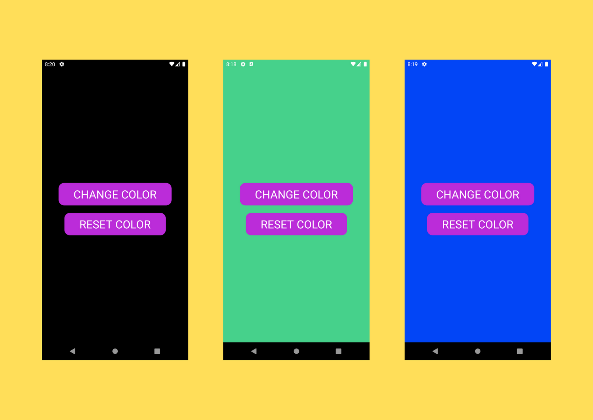

  

# bg-Changer

A React Native app which shows random background colors on button click.

---

  

## Motivation

Create this app to apply basic React Native concepts and help others to start their journey in React Native.

## Screenshots

## Tech/ Framework Used

**Built with**

1. [ReactNative](https://reactjs.org/)

## Want To Be a Contributor?

Read [CONTRIBUTING.md](./CONTRIBUTING.md) for contribution guidelines.

## Available Scripts

In the project directory, you can run:

### 'npx react-native start'

This will start a metro bundler development server.

### 'npx react-native run-android'

Once Android Studio or Xcode set up is complete, then you can launch your app on an Android virtual device or real device using USB by running this command.

### 'npx react-native run-ios'

If you have an iOS device or you are using any apple device you can use this command to run your app on the iOS simulator(macOS only) or on your real device.

Made with :heart: and :coffee: by Debajit Mallick

